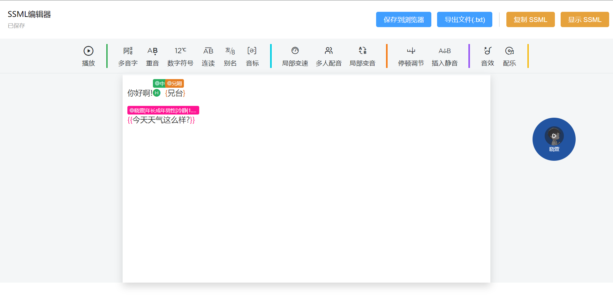
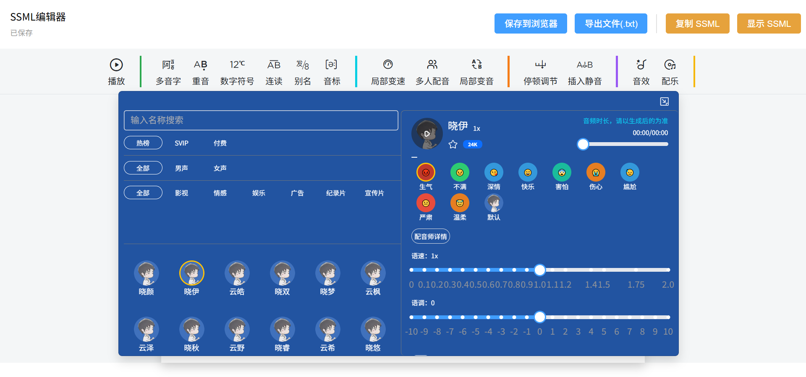

# ssml-editor

模仿[魔音工坊UI](https://www.moyin.com/overview/article-voice)的`SSML`编辑器  
根据[微软语音文档](https://learn.microsoft.com/zh-cn/azure/ai-services/speech-service/speech-synthesis-markup)生成SSML, 可配合大佬项目[tts-vue](https://github.com/LokerL/tts-vue.git)一起使用

## 预览

[在线体验](https://ssml.luoyesheng.top/)




## 开始

详细使用方法请参考[ssml-editor-demo](https://github.com/mekumiao/ssml-editor-demo.git)项目

### 一、环境

- Node 18

### 二、开始

1.安装插件

```sh
yarn add @mekumiao/ssml-editor
```

2.使用

> src/main.ts

```ts
import { createApp } from 'vue'
import App from './App.vue'

import '@mekumiao/ssml-editor/dist/style.css'

import SSMLEditor from '@mekumiao/ssml-editor'

const app = createApp(App)
app.use(SSMLEditor)
app.mount('#app')
```

> src/App.vue

```vue
<script setup lang="ts">
import { EditorView } from '@mekumiao/ssml-editor'
</script>

<template>
  <EditorView></EditorView>
</template>

<style scoped></style>
```

## 开发指南

[开发指南](./DEV.md)

## 参考

1. [阿里TTS](https://ai.aliyun.com/nls/tts)
2. [wangEditor 5](https://www.wangeditor.com/)
3. [slate-table](https://github.com/lqs469/slate-table.git)
4. [wangEditor](https://github.com/wangeditor-team/wangEditor.git)
5. [SlateNode](https://docs.slatejs.org/api/nodes/node) | [SlateTransforms](https://docs.slatejs.org/api/transforms) | [SlateNormalizing](https://docs.slatejs.org/concepts/11-normalizing)
